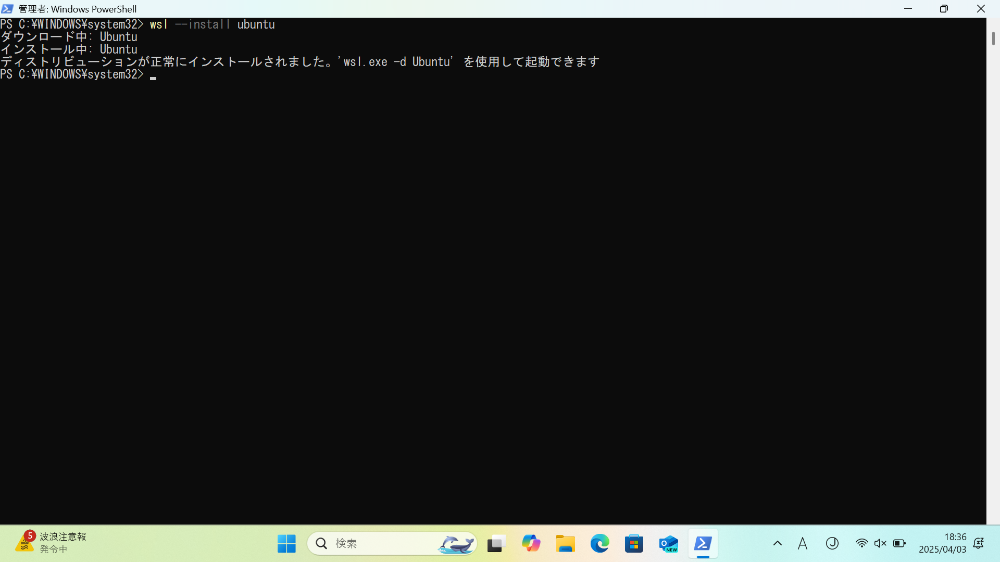
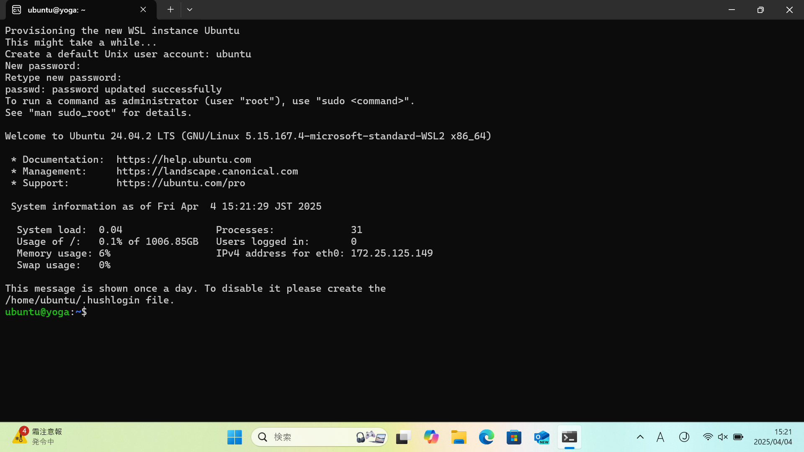

# 総合実験1

## 環境構築

### 0. 事前準備（Windowsのみ）

#### 0.1. [Windows Subsystem for Linux（WSL）](https://learn.microsoft.com/ja-jp/windows/wsl/about)のインストール

ターミナルを管理者モードで起動（以後、管理者モードで起動したターミナルを「PowerShell」と呼ぶ）


PowerShellでコマンド`wsl --install`を実行


インストールが完了したら、マシンを再起動

#### 0.2. Ubuntuのインストール

PowerShellでコマンド`wsl --install ubuntu`を実行



#### 0.3. [usbipd-win](https://learn.microsoft.com/ja-jp/windows/wsl/connect-usb)のインストール

[GitHubのリリースページ](https://github.com/dorssel/usbipd-win/releases)から.msiファイルをダウンロードして実行


Ubuntuとusbipd-winのインストールが完了したら、もう一度マシンを再起動

#### 0.4. 倒立振子の接続

PowerShellとUbuntuを起動（Ubuntu初回起動時はユーザー名とパスワードの設定が必要）




倒立振子をUSBポートに接続し、PowerShellで以下のコマンドを実行（適宜`usbipd list`で接続状況を確認）

```powershell
usbipd bind --hardware-id 1962:2080
usbipd attach --hardware-id 1962:2080 --auto-attach --wsl
```


これにより、倒立振子がUbuntuに接続される（`lsusb`で確認可能）


次回以降、0.1-0.3の手順は省略可能（0.4の手順は毎回必要）

### 1. Dockerの準備

#### 1.1. Docker Desktopのインストール

[公式サイト](https://www.docker.com/products/docker-desktop)からインストーラーをダウンロードして実行


インストールが完了したら、マシンを再起動

#### 1.2. Docker Desktopの起動

Docker Desktopを起動しておく


### 2. Visual Studio Code（VSCode）の準備

#### 2.1. VSCodeのインストール

[公式サイト](https://code.visualstudio.com)からインストーラーをダウンロードして実行


#### 2.2. VSCode拡張機能のインストール

VSCode拡張機能「Dev Containers」をインストール


#### 2.3. Dev Containersの起動

VSCodeで実験のディレクトリを開く

左下の「><」アイコンをクリックして「Reopen in Container」を選択


