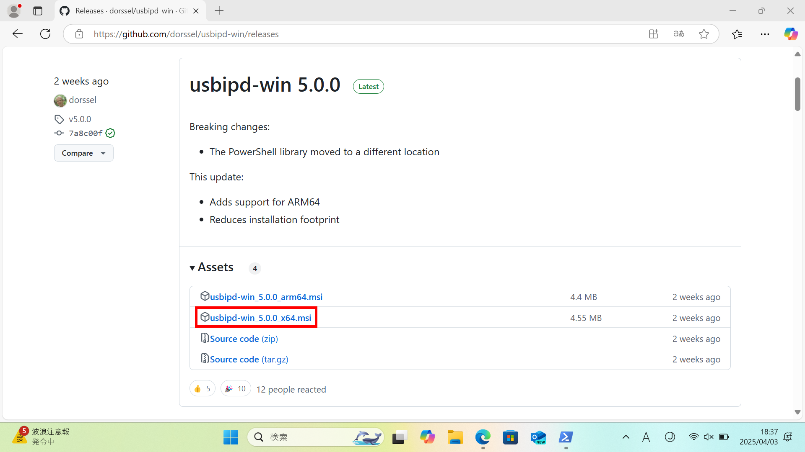

# 総合実験1

## 環境構築

### 0. 事前準備（Windowsのみ）

#### 0.1. [Windows Subsystem for Linux（WSL）](https://learn.microsoft.com/ja-jp/windows/wsl/about)のインストール

PowerShellを**管理者として実行**（以後、PowerShellは常に管理者として実行すること）


PowerShellで以下のコマンドを実行し、WSLをインストール

```powershell
wsl --install
```


※ 「サーバー名またはアドレスは解決されませんでした」と表示された場合は、インターネット接続を確認

WSLのインストールが完了したら、**マシンを再起動**

#### 0.2. Ubuntuのインストール

PowerShellで以下のコマンドを実行し、WSLにUbuntuをインストール

```powershell
wsl --install ubuntu
```


#### 0.3. [usbipd-win](https://learn.microsoft.com/ja-jp/windows/wsl/connect-usb)のインストール

[GitHubのリリースページ](https://github.com/dorssel/usbipd-win/releases)からインストーラーをダウンロードして実行



※ ファイルをダウンロードしただけではインストールされないので、必ずダウンロードしたファイルを実行すること

Ubuntuとusbipd-winのインストールが完了したらもう一度、**マシンを再起動**

#### 0.4. 倒立振子の接続

Ubuntuを起動し、ユーザー名とパスワードを設定（何でもOK）


Ubuntuで以下のコマンドを実行し、USBデバイスの既定パーミッションを変更

```bash
echo 'SUBSYSTEM=="usb", ATTR{idVendor}=="1962", ATTR{idProduct}=="2080", MODE="0666"' | sudo tee /etc/udev/rules.d/100-usb.rules
sudo udevadm control --reload-rules
```


倒立振子をUSBポートに接続し、**PowerShellで**以下のコマンドを実行

```powershell
usbipd bind --hardware-id 1962:2080
usbipd attach --hardware-id 1962:2080 --auto-attach --wsl
```


これにより、倒立振子がWSLのUbuntuに接続される

※ 次回以降、上記の手順は省略可能（ただし、最後の`usbipd attach ...`だけは毎回実行する必要あり）

### 1. Python環境の構築

#### 1.1. Minicondaのインストール

##### 1.1.1. Windows

上記の事前準備完了後、Ubuntuで以下のコマンドを実行

```bash
wget https://github.com/conda-forge/miniforge/releases/latest/download/Miniforge3-Linux-x86_64.sh
bash ./Miniforge3-Linux-x86_64.sh -b -p ~/miniforge3
~/miniforge3/bin/conda init
source ~/.bashrc
```


##### 1.1.2. Mac

[公式サイト](https://www.anaconda.com/download/success)のMiniconda Installersからインストーラーをダウンロードして実行

TODO: MacにMinicondaをインストールする手順を記載

#### 1.2. [hidapi](https://trezor.github.io/cython-hidapi/index.html)パッケージのインストール

以下のコマンドを実行し、hidapiパッケージをインストール

```bash
conda install hidapi
```

### 2. 動作確認

#### 2.1. テストスクリプトのダウンロード

TODO: BEEF+から`test.py`をダウンロードする手順を記載

#### 2.2. テストスクリプトの配置

##### 2.2.1. Windows

テストスクリプト（`test.py`）をUbuntuのホームディレクトリにコピー


##### 2.2.2. Mac

TODO: ダウンロードした`test.py`をホームディレクトリに配置する手順を記載

#### 2.3. テストスクリプトの実行

以下のコマンドを実行し、テストスクリプトを実行

```bash
python test.py
```


車輪の回転と角度の取得が確認できれば成功

※ 車輪が回転しない場合、「モーターの電源がオフになっている」または「電池が切れている」可能性があるので、確認すること
