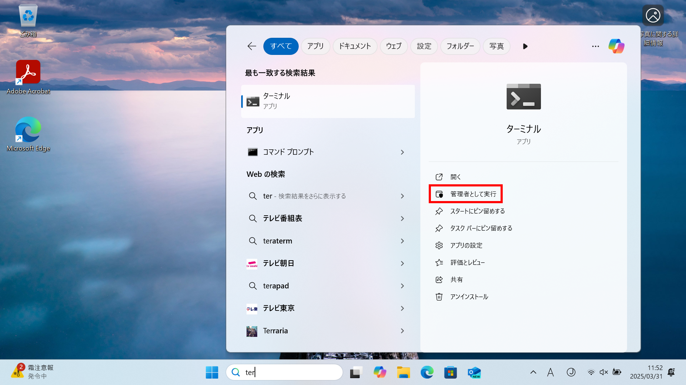
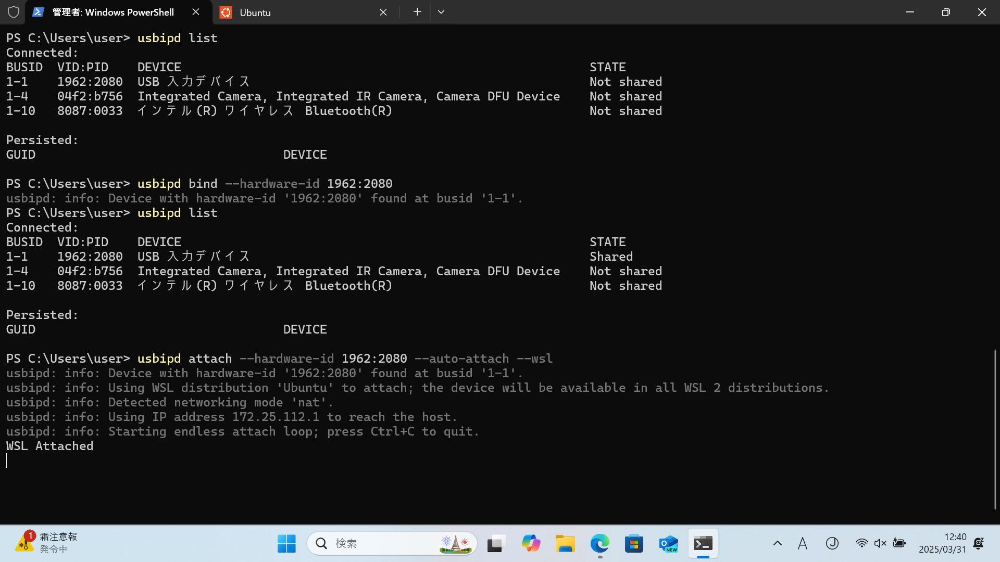

# 総合実験1

## 環境構築

### 0. 事前準備（Windowsのみ）

#### 0.1. [Windows Subsystem for Linux（WSL）](https://learn.microsoft.com/ja-jp/windows/wsl/about)のインストール

ターミナルを管理者モードで起動（以後、管理者モードで起動したターミナルを「PowerShell」と呼ぶ）



PowerShellでコマンド`wsl --install`を実行


インストールが完了したら、マシンを再起動

#### 0.2. Ubuntuのインストール

PowerShellでコマンド`wsl --install ubuntu`を実行


#### 0.3. [usbipd-win](https://learn.microsoft.com/ja-jp/windows/wsl/connect-usb)のインストール

[GitHubのリリースページ](https://github.com/dorssel/usbipd-win/releases)から.msiファイルをダウンロードして実行


Ubuntuとusbipd-winのインストールが完了したら、もう一度マシンを再起動

#### 0.4. 倒立振子の接続

PowerShellとUbuntuを起動（Ubuntu初回起動時はユーザー名とパスワードの設定が必要）


倒立振子をUSBポートに接続し、PowerShellで以下のコマンドを実行（適宜`usbipd list`で接続状況を確認）

```powershell
usbipd bind --hardware-id 1962:2080
usbipd attach --hardware-id 1962:2080 --auto-attach --wsl
```



これにより、倒立振子がUbuntuに接続される（`lsusb`で確認可能）


次回以降、0.1-0.3の手順は省略可能（0.4の手順は毎回必要）

### 1. Pythonのインストール

#### 1.1. Pythonのインストール

使用するOSに応じた方法でPythonをインストール

（例）WSLでUbuntuを使用する場合

```bash
sudo apt update
sudo apt install python3 python3-pip python3-venv
```

#### 1.2. ライブラリのインストール

以下のライブラリをインストール

- [hidapi](https://trezor.github.io/cython-hidapi/index.html)（USBデバイスとの通信に使用）
- [matplotlib](https://matplotlib.org/stable/index.html)（グラフ描画に使用）

（例）WSLでUbuntuを使用する場合

```bash
sudo python3 -m venv /venv
sudo /venv/bin/python3 -m pip install hidapi matplotlib
sudo /venv/bin/python3 wheel.py
```
